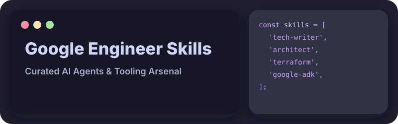

<div align="center">
  
</div>

<br>


This repository centralises high-leverage AI agent skills and tooling for Google Cloud Engineers, accelerating infrastructure delivery and ensuring architectural rigour. By establishing a unified collection of modular, production-tested agent capabilities, engineering teams can eliminate repetitive tasks, enforce security compliance, and standardise deployment practices.

The value proposition is built upon three foundational pillars:

- 🚀 **Immediate Velocity** — Engineers can bypass the scaffolding phase by leveraging pre-built, domain-specific agent skills that instantly hook into standard workflows. This reduces time-to-market for complex infrastructural deployments.
- 🛡️ **Enforced Standardisation** — Curated skills ensure that code generation, Terraform modules, and architectural designs adhere strictly to Google Cloud best practices. This minimises the risk of misconfigurations and security vulnerabilities.
- 🧩 **Extensible Ecosystem** — The repository serves as a scalable foundation where new capabilities can be seamlessly integrated and distributed. This prevents silos and empowers cross-functional teams to share high-quality technical assets.

<br>


To begin using these tools immediately, add the required skills to your local environment using the CLI. You can pull them down in seconds and start extending your agent's capabilities.

```bash
# Add all skills from this repository
npx skills add https://github.com/benjaminwestern/google-engineer-skills
```

Or you can install individual skills:

```bash
npx skills add https://github.com/benjaminwestern/google-engineer-skills --skill tech-writer
```


These skills require certain CLI tools to be installed on your system. The easiest way to manage these dependencies is using [mise](https://mise.jdx.dev/):

```bash
# Copy the example configuration
cp mise.toml.example mise.toml

# Install all required tools
mise up
```

All skills require [Node.js](https://nodejs.org/) as the runtime for the `npx skills` CLI. Additional global NPM packages like `@google/gemini-cli`, `opencode-ai`, `@playwright/cli`, or `@googleworkspace/cli` may be required by specific skills and are managed automatically via `mise`.

### Managing Skills

| Command | Description |
|---------|-------------|
| `npx skills check` | Check if there are updates available for installed skills |
| `npx skills update` | Update all installed skills to the latest version |
| `npx skills list` | List all installed skills |
| `npx skills find <query>` | Query the skills directory for skills matching the query |

<br>


| Skill | Description | Required Tools |
|-------|-------------|----------------|
| ✍️ **[tech-writer](skills/tech-writer/SKILL.md)** | Produces rigorous, persuasive technical documentation and solution designs. It enforces British English, the Pyramid Principle, and visual markdown generation for high-impact communication. | - |
| 🎨 **[github-profile-architect](skills/github-profile-architect/SKILL.md)** | Constructs breathtaking, highly personalised digital magazines and documentation layouts. It leverages dynamic SVGs, Bento Box aesthetics, and strict colour palettes. | - |
| ☁️ **[cloud-foundation-fabric](skills/cloud-foundation-fabric/SKILL.md)** | Builds Google Cloud resources using Cloud Foundation Fabric Terraform modules. It provides production-ready modules for GCP infrastructure with proper versioning constraints. | [Terraform](https://www.terraform.io/) |
| 🏗️ **[terraform](skills/terraform/SKILL.md)** | Creates and manages scalable infrastructure through code. It covers modules, testing paradigms, CI/CD pipelines, and infrastructure-as-code security compliance. | [Terraform](https://www.terraform.io/) |
| 📊 **[d2](skills/d2/SKILL.md)** | Generates professional architectural diagrams using the D2 declarative language. It supports sequence diagrams, flowcharts, ERDs, and UML class diagrams. | [D2](https://d2lang.com/), [Go](https://go.dev/) |
| 🦆 **[duckdb](skills/duckdb/SKILL.md)** | Use DuckDB for analytical data processing, SQL queries, and data import/export. Use when working with CSV, Parquet, JSON files, running SQL analytics, or building data pipelines with embedded analytics database. | - |
| 🕷️ **[skill-crawler](skills/skill-crawler/SKILL.md)** | Converts crawled external documentation directly into usable opencode skills. It works alongside playwright-cli to generate SKILL.md files from extracted web content. | `@playwright/cli` |
| 🎭 **[playwright-cli](skills/playwright-cli/SKILL.md)** | Automates browser interactions for comprehensive web testing and data extraction. It enables robust UI verification, form manipulation, and screenshot capture. | `@playwright/cli` |
| ⚙️ **[opencode-dev](skills/opencode-dev/SKILL.md)** | Manages OpenCode agents, tools, MCP servers, and comprehensive workflows. It handles the configuration management required for advanced OpenCode development. | `opencode-ai` |
| 🎬 **[charm-vhs](skills/charm-vhs/SKILL.md)** | Writes and edits VHS `.tape` files for creating terminal demo GIFs and videos. Enables automated recording of terminal sessions with precise timing and styling. | [VHS](https://github.com/charmbracelet/vhs), [Go](https://go.dev/) |
| 🖥️ **[terminal-ui-engineer](skills/terminal-ui-engineer/SKILL.md)** | Constructs beautiful, highly interactive Terminal UIs using Charmbracelet's Gum. It engineers bulletproof shell scripts with robust dependency management and modern UX aesthetics. | [Gum](https://github.com/charmbracelet/gum) |
| 🔍 **[jq](skills/jq/SKILL.md)** | Query and transform JSON data using jq. Use when parsing JSON files, extracting data from API responses, filtering arrays, and transforming JSON structures in shell scripts. | [jq](https://jqlang.github.io/jq/) |
| 🔄 **[skill-registry-sync](skills/skill-registry-sync/SKILL.md)** | Synchronise README.md references with installed skills from .skill-lock.json. Keeps external skill registry references in documentation up to date. | - |

<br>


### Deep Modules, Simple Interfaces

We ruthlessly hide implementation chaos and present clean, intuitive boundaries. Every skill must expose a simple interface while managing significant internal complexity.

### Standardised File Structure

Each skill must adhere to a strict, predictable directory structure to ensure compatibility and ease of discovery.

```text
skills/
├── <skill-name>/
│   ├── SKILL.md              # Main skill documentation (REQUIRED)
│   └── references/           # Additional reference documentation (OPTIONAL)
│       ├── <topic>.md
│       └── ...
```

### The SKILL.md Contract

Every `SKILL.md` file must include specific YAML frontmatter. This ensures the parsing engine can properly categorise and index the capability.

```yaml
---
name: <skill-name>
version: "1.0.0"
description: Clear description of what this skill accomplishes.
metadata:
  source_url: https://github.com/...        # Optional source repository
---
```

<br>


This repository unifies our collective capabilities to expose them via simple interfaces.

### Skills Standard

- [agentskills.io](https://agentskills.io/home) — Official skill definitions and documentation
- [agentskills/agentskills](https://github.com/agentskills/agentskills) — Source repository for skill specifications
- [vercel-labs/skills](https://github.com/vercel-labs/skills) — CLI registry and installing package (`npx skills`)

### Other Skill Registries

Expand your agent's toolkit with these supplementary skill collections:

- 📚 `npx skills add https://github.com/google/adk-docs`
- 📦 `npx skills add https://github.com/jeffallan/claude-skills --skill atlassian-mcp`
- 📦 `npx skills add https://github.com/google-gemini/gemini-skills`
- ⚛️ `npx skills add https://github.com/google-labs-code/stitch-skills --skill react:components`
- 🛠️ `npx skills add https://github.com/google-gemini/gemini-cli`
- 🏢 `npx skills add https://github.com/googleworkspace/cli`
- ✍️ `npx skills add https://github.com/blader/humanizer`
- 🎨 `npx skills add https://github.com/leonxlnx/taste-skill`
- 📦 `npx skills add https://github.com/vercel-labs/skills`

<br>
<div align="center">
  <sub>Built with rigorous precision by <b>@benjaminwestern</b> and <b>@emilehofsink</b>.</sub>
</div>
